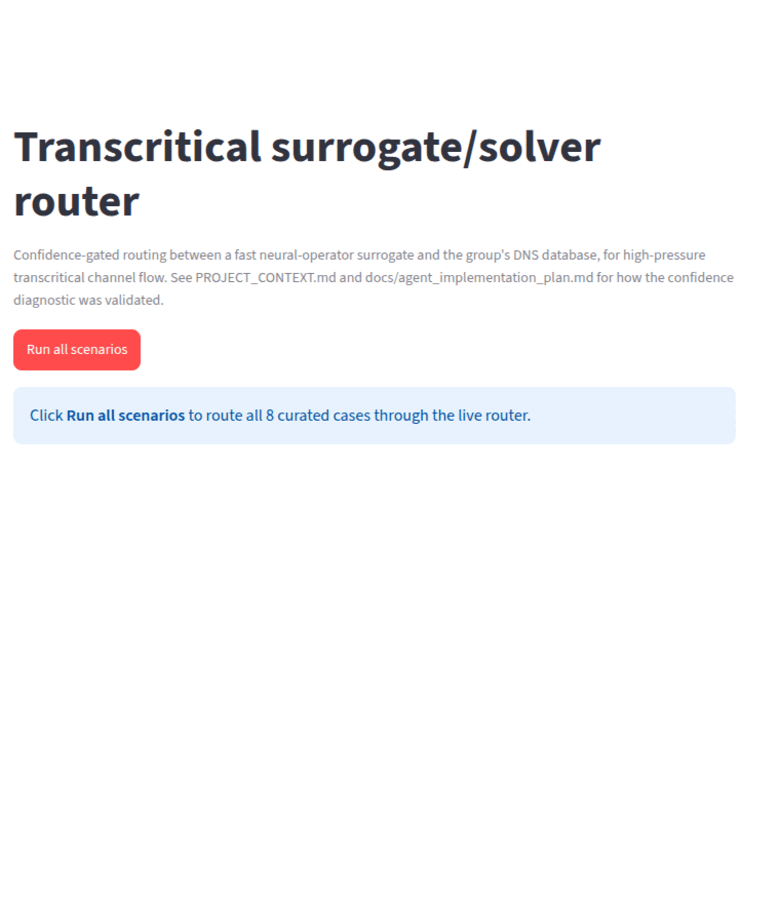

# METIS — High-Pressure Transcritical ML Analysis & Discovery Framework

[](https://github.com/gbareas/METIS/actions/workflows/ci.yml)

**M**achine-learning **E**ngine for **T**ranscritical **I**nsight & **S**tatistics.

## What it is

A reusable analysis and physical-discovery layer that sits **downstream**
of the group's DNS solver, **RHEA** (*Reproducible Hybrid-architecture
flow solver Engineered for Academia*), for high-pressure transcritical
channel flow. RHEA generates the physics and stays upstream and
authoritative; METIS standardises how its output is ingested, validated,
turned into features, analysed, modelled, and reported — so a new study
configures the framework instead of rebuilding the pipeline.

## What it can do

- **Ingest & validate** RHEA snapshots and homogeneous-plane slices into
  `DNSCase` / `SliceCase`; catch bad or incompatible data before analysis
  (`metis.data.{ingestion,registry,validation}`).
- **Standard physics** — bulk dimensionless groups, wall friction
  Reynolds numbers, 1-D wavenumber spectra, snapshot POD — cross-checked
  bit-for-bit against published results (`metis.features`).
- **Regime discovery**, frozen as the reproducible `regime-v1` benchmark
  (`metis benchmark regime-v1`; see `FINDINGS.md`).
- **One analysis API** — `metis analyze physics|spectra|pod|
  regime-features <case>` — each producing a standard, validated,
  saveable result.
- **Cached feature datasets** so re-running an evaluation doesn't re-read
  raw DNS (`metis dataset build`).
- **Reproducible ML** — leakage-safe preprocessing, a small trainer,
  PCA/autoencoder representation models, physics-aware evaluation, MLflow
  experiment tracking, and a reporting layer (`metis report`).
- **`metis` CLI** and an **artifact registry** tying it together.
- A separate **router-agent module** (Track C/D) — OOD-gated routing
  between a neural-operator surrogate and the DNS database, with a
  single-tool LLM explanation layer. See below.

## Install

```bash
pip install -e ".[dev]"     # framework + tests; installs the `metis` command
pytest -q
```

Optional extras: `ml` (torch, scikit-learn, mlflow), `report`
(matplotlib), `router` + `demo` (the router module), documented in
`pyproject.toml`.

## One reproducible example

No group data needed — generate a synthetic case and run the suite:

```bash
python scripts/generate_mock_dns.py --out data/mock/case_mock.h5
pytest -q
```

With the group's DNS data (the standard `raw/` `processed/`
`processed_slices/` layout under one root — point METIS at it with
`--data-root`, `$METIS_DATA_ROOT`, or `data.root` in
`configs/default.yaml`):

```bash
export METIS_DATA_ROOT=/path/to/dns_data
metis cases list
metis case validate case01
metis analyze physics case01
metis benchmark regime-v1
metis report regime-v1 --from results/regime_v1.json
metis report i2b-representation --from results/   # bundles the i2b_*.json study outputs
```

## Router agent (Track C/D)



Routes a transcritical query to a fast neural-operator surrogate **or**
the DNS database based on a *validated* out-of-distribution confidence
signal (blind surrogate error tracks the cold-wall temperature ratio
crossing the pseudo-critical point), and explains the decision in plain
language. The LLM never makes the routing decision. Full write-up,
architecture diagram, and the link to the group's Pub 4 / Pub 5 work:
**[`docs/router_agent.md`](docs/router_agent.md)**.

## Where to read more

- **[`docs/`](docs/README.md)** — getting started, architecture, data
  layout, how to add an analysis or a model, reproducibility.
- **`PROJECT_CONTEXT.md`** — current status, milestone log, active
  priorities.
- **`FINDINGS.md`** — the research log (regime discovery §1-5,
  representation study §6).
- **`METIS_detailed_next_steps.md`** — the implementation backlog.
