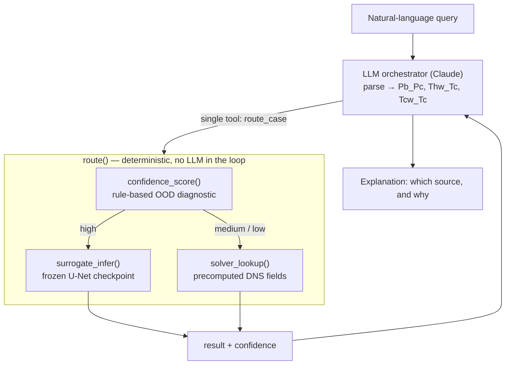

# METIS — High-Pressure Transcritical ML Analysis & Discovery Framework

[](https://github.com/gbareas/METIS/actions/workflows/ci.yml)

**M**achine-learning **E**ngine for **T**ranscritical **I**nsight & **S**tatistics.

Named to sit alongside the group's DNS solver, **RHEA** (*Reproducible
Hybrid-architecture flow solver Engineered for Academia*) — RHEA generates
the physics, METIS extracts the insight.

A reusable ML analysis layer sitting downstream of the group's DNS solver
for high-pressure transcritical flow. The DNS solver stays upstream and
authoritative; this framework standardizes ingestion, physics extraction,
and data-driven analysis of what it produces.

See `PROJECT_CONTEXT.md` for current status and active priorities, and
`docs/` for the full roadmap documents this repo implements.

## Router agent — OOD-gated surrogate/solver routing

A self-contained module (`src/metis/router/`) that answers a
transcritical channel-flow query by routing it to **either** a fast
neural-operator surrogate **or** the group's full-solver (DNS) database,
based on a *validated* out-of-distribution confidence signal, and
explains the decision in plain language.


*The curated demo (`scripts/router_demo_app.py`) routing 8 cases through
the real checkpoint + DNS lookup: confident cases → surrogate, a case
across the pseudo-critical boundary → full solver, a genuinely novel
point → explicit "no precomputed answer" rather than a fabricated one.*



The confidence rule is not a new metric — it encodes a validated finding
from the group's neural-operator study: blind surrogate error is
architecture-independent and tracks the **cold-wall temperature ratio
`Tcw_Tc`** crossing the pseudo-critical boundary, not distance in the
surrogate's own `(Pb_Pc, Thw_Tc)` conditioning:

| Case   | `Tcw_Tc` | Regime                              | Blind surrogate `T'` error |
|--------|----------|-------------------------------------|----------------------------|
| case15 | 0.982    | mild excursion, still subcritical   | ~0.37 (≈ in-distribution)  |
| case10 | 1.035    | **crosses `T/T_c = 1`**             | ~0.92 (collapse)           |

The LLM never makes the routing decision — `route()` decides
deterministically in Python and the LLM only explains the result. Full
rationale, the rejected alternative diagnostic, and the link to the
group's Pub 4 / Pub 5 work: **[`docs/router_agent.md`](docs/router_agent.md)**.

```bash
pip install -e ".[router,demo]"
pip install -e ../pub5_neural_operators     # see pyproject.toml for why
streamlit run scripts/router_demo_app.py    # 8 curated scenarios, both branches
```

## Quickstart

```bash
pip install -e ".[dev]"
python scripts/generate_mock_dns.py --out data/mock/case_mock.h5
pytest -q
```

The mock-DNS generator produces a small synthetic HDF5 file with the
same layout the ingestion layer expects, so the pipeline runs and tests
pass without needing the group's (multi-GB, access-restricted) real DNS
output.

With access to the group's DNS data (the standard `raw/`, `processed/`,
`processed_slices/` layout under one root), run the regime-discovery
reference task end-to-end. Point the scripts at that root via
`--data-root`, the `METIS_DATA_ROOT` environment variable, or `data.root`
in `configs/default.yaml` (resolution order: flag > config > env):

```bash
export METIS_DATA_ROOT=/path/to/dns_data
python scripts/run_regime_discovery.py   # compact vs. rich feature sets
python scripts/run_regime_ablation.py    # per-block ablation
python scripts/run_regime_blockwise.py   # MFA block-wise combination
```

Each writes its results to `results/` (override with `--output`); see
`FINDINGS.md` for the interpreted findings.

## Layout

```
src/metis/
    data/ingestion/     # HDF5Reader -> DNSCase (3D snapshots)
                        # SliceReader -> SliceCase (time-resolved 2D planes)
    data/validation/
    data/preprocessing/
    data/datasets/
    features/           # physics.py (bulk quantities), spectra.py, pod.py, regime.py
    models/             # baselines, classical_ml, lstm, fno, wno, deeponet
    training/
    evaluation/         # regime.py: PCA, clustering, ARI/LOCO, MFA combination
    router/             # OOD-gated surrogate/solver routing + LLM explanation
                        # layer (Track C/D) — see docs/router_agent.md
    registry/
    inference/
    monitoring/
    api/
    testing/            # mock DNS + mock slice generators, shared test fixtures
```

`scripts/router_demo_app.py` is the Streamlit demo front end for the
router module.

## Status

Ingestion (`HDF5Reader` for 3D snapshots, `SliceReader` for time-resolved
2D planes) is wired to, and cross-checked against, the group's real DNS
output — not just the synthetic mock data used in tests. The standard
physics layer (bulk dimensionless groups, spectra, POD) is built and
validated bit-for-bit against published Pub 4 results. The
regime-discovery reference task has been run end-to-end with a full
findings trail.

The router module (Track C/D) is feature-complete end-to-end: the
deterministic core, the precomputed solver fallback, the single-tool LLM
layer, and a curated demo. The live LLM round trip is unverified pending
Anthropic credentials in the dev environment.

See `PROJECT_CONTEXT.md` for current priorities and `FINDINGS.md` for
results.
