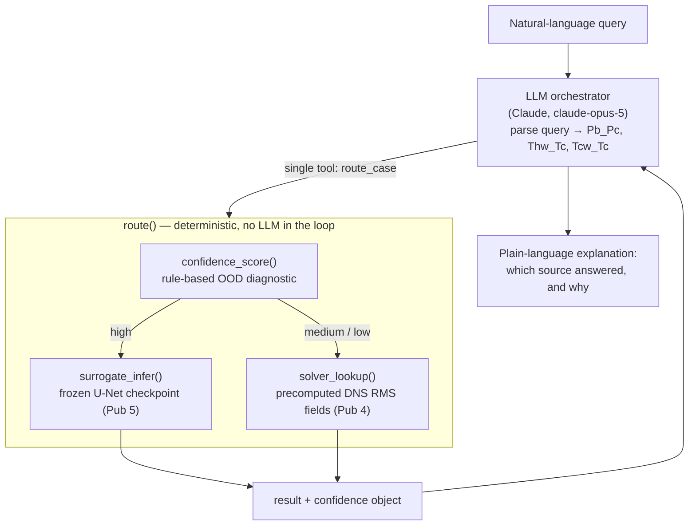

# Router agent — OOD-gated surrogate/solver routing

*Track C/D of `metis`. Built solo as a portfolio module; decoupled from
the group-infrastructure tracks. See `docs/agent_implementation_plan.md`
for the milestone history.*

## What it is

A small agent that answers a transcritical channel-flow query by routing
it to **either** a fast neural-operator surrogate **or** the group's
full-solver (DNS) database, decides which to trust from an
out-of-distribution (OOD) confidence signal, and explains the decision in
plain language.

```
"Case with Pb_Pc=1.5, Thw_Tc=1.185, Tcw_Tc=1.035 — which source, and why?"
  → routed to the full solver. Confidence low: Tcw_Tc=1.035 crosses the
    pseudo-critical boundary, matching case10's known surrogate collapse
    (blind OOD T' error ~0.92).
```

## Why it needs to exist

Neural operators are fast but fail *silently* outside their training
distribution — here, specifically near the pseudo-critical point, where
CO₂ properties (density, `cp`) vary sharply over a narrow temperature
band. The usual options are "trust the surrogate blindly" (risky) or
"always run the full solver" (throws away the speed-up). This agent
productizes a **validated** confidence policy instead of inventing a new
one: it turns the OOD findings from the group's neural-operator study
(referred to below as *Pub 5*) into something that behaves.

## Architecture



Module map (`src/metis/router/`):

| File | Role |
|---|---|
| `confidence.py` | Rule-based OOD/confidence diagnostic. **The load-bearing science.** |
| `surrogate.py` | Wraps the frozen Pub 5 `unet_raw_ood` checkpoint as `surrogate_infer()`. |
| `solver.py`   | `solver_lookup()` — near-exact match into the group's existing DNS database. Never a live solve. |
| `core.py`     | `route()` — ties the three together. No LLM. |
| `agent.py`    | `ask()` — the LLM orchestrator, exposing exactly one tool, `route_case`. |
| `demo.py`     | 8 curated scenarios (`run_scenarios()`) exercising every branch. |

## The confidence policy (the part to defend without any AI-tooling caveat)

`confidence_score()` reuses a *validated* result from Pub 5's OOD campaign
(its FINDINGS §5.13, "H4 OOD"): blind OOD error on the task-A2
checkpoints is **architecture-independent** (spread ~0.05 across six
architectures) and tracks the **cold-wall temperature ratio `Tcw_Tc`**
— *not* distance in the surrogate's own conditioning space `(Pb_Pc,
Thw_Tc)`. Both Pub 5 held-out cases sit *inside* the training `(Pb_Pc,
Thw_Tc)` envelope, yet behave completely differently:

| Case | `Tcw_Tc` | Regime | Blind OOD `T'` error |
|---|---|---|---|
| case15 | 0.982 | mild excursion, still subcritical | ~0.37 (close to in-distribution) |
| case10 | 1.035 | **crosses the pseudo-critical boundary** (`T/T_c ≥ 1`) | ~0.92 (collapse) |

So the diagnostic is a rule, not a learned score:

- **`high`** — `Pb_Pc`, `Thw_Tc`, `Tcw_Tc` all inside the case01–09
  training ranges → trust the surrogate.
- **`medium`** — `Tcw_Tc` above the training max (0.95) but still
  subcritical, *or* `Pb_Pc`/`Thw_Tc` outside its range → fall back.
- **`low`** — `Tcw_Tc ≥ 1.0`, i.e. across the pseudo-critical boundary
  → fall back.

**Why only `high` is trusted.** The finding rests on n = 2 OOD cases
(Pub 5's own wording: "suggestive, not proven"). The policy is
deliberately conservative because of that small n — `medium` and `low`
are both routed to the solver. `medium` is kept as a *distinct level*
only so the explanation the agent gives can be honest about *how* far
out the case is, not because it is currently routed differently from
`low`.

**A diagnostic that was tried and rejected.** Pub 5 also tested a
latent-geometry diagnostic (principal angles between the incoming data's
modal subspace and the training subspace, à la Pub 4's Grassmann
analysis). It *failed* — correlation with OOD skill ≈ −0.13 (Pub 5
FINDINGS §5.17). It is deliberately **not** used here. Reusing a
validated negative result is as much a part of "productize the science,
don't invent new claims" as reusing the positive one.

## Why the agent exposes one tool, not three

The obvious design is three tools — `surrogate_infer`, `confidence_score`,
`solver_lookup` — and let the LLM call them in sequence. That is exactly
what this project's design principle rules out: if the LLM sequences
those calls, **the LLM is enacting the routing policy**, which makes the
routing decision an unvalidated LLM behaviour sitting on top of the
validated one.

Instead, `route()` runs deterministically and end-to-end in Python.
`agent.py` wraps it as a **single** tool, `route_case`. The LLM's job is
narrow: parse the natural-language query into `(Pb_Pc, Thw_Tc, Tcw_Tc)`,
call `route_case` once, and turn the returned decision into prose. It
never re-derives or overrides the decision. Built on the Anthropic SDK's
tool runner (single tool, single turn).

## What is real vs. what is precomputed

- **Surrogate** — the actual frozen `unet_raw_ood` checkpoint from Pub 5
  (task A2, `xy_slice_1`, trained on case01–09). `surrogate_infer()`
  reproduces the checkpoint's recorded blind-OOD errors for case10/case15
  to ~3 × 10⁻⁴ relative. Architecture hyperparameters and normalization
  constants aren't stored in the checkpoint file; they're reconstructed
  deterministically from the same cases/slice/task used at train time.
- **Solver** — `solver_lookup()` returns the group's **actual converged
  DNS RMS fields** for a matched case, on the same `xy_slice_1` plane and
  in the same `{fields, field_means}` shape as the surrogate output, so
  the two are directly comparable. It is a near-exact `(Pb_Pc, Thw_Tc,
  Tcw_Tc)` match (tol 1e-6) against the group's case-descriptor table —
  **never a nearest-neighbour guess**. A genuinely novel operating point
  raises `KeyError` rather than returning a "close enough" case. It
  covers only the 11 cases that already have DNS output (case01–09,
  case10, case15).
- **LLM round trip** (`ask()`) — needs live Anthropic credentials;
  `route_case`'s underlying logic is tested against the real
  checkpoint/DNS data, but the live call itself is currently unverified
  (no key configured in the dev environment).

## Link to the group's publications

- **Pub 4** (Grassmann ROM / modal analysis) — supplies the DNS database
  and the `case_descriptors.json` `(Pb_Pc, Thw_Tc, Tcw_Tc)` table that
  `solver_lookup()` matches against, and the physical framing of the
  transcritical case family. The rejected latent-geometry diagnostic is a
  direct descendant of Pub 4's principal-angle method.
- **Pub 5** (neural-operator benchmarking + OOD) — supplies the frozen
  surrogate checkpoint and, crucially, the **validated OOD finding**
  (`Tcw_Tc`-driven, architecture-independent error; latent-geometry
  diagnostic fails) that `confidence.py` encodes as a routing rule.

The scientific content of this module is entirely *downstream* of those
two. What's new is only the packaging: a deterministic router plus a
thin LLM explanation layer, both standard 2026 engineering.

## Limitations / out of scope (v1)

- Confidence rule rests on n = 2 OOD cases — conservative by design.
- No live HPC/Slurm solver; the "full solver" path is a database lookup.
- No mapping from continuous physical units (inlet pressure/temperature,
  mass flow) to the `(Pb_Pc, Thw_Tc, Tcw_Tc)` ratios — there is no
  validated one in Pub 4/5, so the tool takes the ratios directly.
- Single frozen checkpoint, single slice plane (`xy_slice_1`), single
  case family. No retraining.

## Running it

```bash
pip install -e ".[router,demo]"
pip install -e ../pub5_neural_operators   # forces an editable install of
                                          # neuralop_bench; see pyproject.toml

# curated scenarios through the deterministic core (needs the group's
# checkpoint + DNS data on this machine):
streamlit run scripts/router_demo_app.py

# the LLM layer (needs ANTHROPIC_API_KEY):
python -c "from metis.router.agent import ask; print(ask('Pb_Pc=1.5, Thw_Tc=1.1, Tcw_Tc=0.95 — which source?'))"

# tests (integration tests skip without the checkpoint):
pytest -q tests/integration/test_router.py tests/integration/test_demo.py
```
